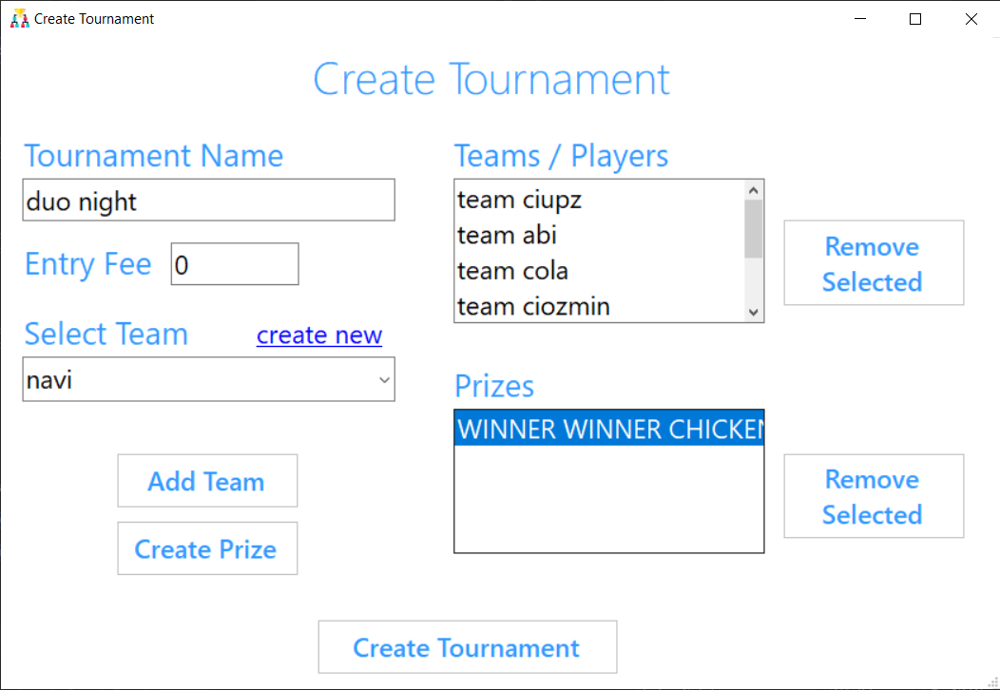

<!-- Improved compatibility of back to top link: See: https://github.com/othneildrew/Best-README-Template/pull/73 -->

<!--
*** Thanks for checking out the Best-README-Template. If you have a suggestion
*** that would make this better, please fork the repo and create a pull request
*** or simply open an issue with the tag "enhancement".
*** Don't forget to give the project a star!
*** Thanks again! Now go create something AMAZING! :D
-->

<!-- PROJECT SHIELDS -->
<!--
*** I'm using markdown "reference style" links for readability.
*** Reference links are enclosed in brackets [ ] instead of parentheses ( ).
*** See the bottom of this document for the declaration of the reference variables
*** for contributors-url, forks-url, etc. This is an optional, concise syntax you may use.
*** https://www.markdownguide.org/basic-syntax/#reference-style-links
-->
[![LinkedIn][linkedin-shield]][linkedin-url]

<!-- PROJECT LOGO -->
 

  

<h3 align="center">Tournament Tracker</h3>

  

    System for organizing and managing tournaments
     
  

<!-- TABLE OF CONTENTS -->

  
Table of Contents

  <ol>
    <li>
      <a href="#about-the-project">About The Project</a>
      <ul>
        <li><a href="#built-with">Built With</a></li>
      </ul>
    </li>
    <li><a href="#usage">Usage</a></li>
    <li><a href="#roadmap">Roadmap</a></li>
    <li><a href="#acknowledgments">Acknowledgments</a></li>
  </ol>

<!-- ABOUT THE PROJECT -->
## About The Project

    

The Tournament Tracker project is a .NET desktop application designed to help users organize, view, and manage tournament brackets. Built using the C# programming language and Windows Forms, it provides a straightforward user interface for managing teams, matchups, and tournament results.

The application uses the Dapper ORM to simplify database access for storing tournament data and supports both SQL databases and dynamically generated text file storage that assigns IDs similarly to a traditional database. Additionally, it includes a mailing feature to keep contestants informed about tournament progress and updates.

### Features:

- Organize teams and set entry fees
- Track live tournament progress across multiple rounds
- Update results and determine winners for each matchup
- Supports both SQL database and text file storage options
- Handles bye matchups when there are not enough teams

(<a href="#readme-top">back to top</a>)

### Built With

* [![.NET][dotNET]][dotNET-url]
* [![SQL][MSSQL]][MSSQL-url]

(<a href="#readme-top">back to top</a>)

<!-- USAGE EXAMPLES -->
## Usage

To use the Tournament Tracker application, follow these steps:

1. Create a New Tournament:

- Launch the application and select `Create Tournament` at the bottom of the [Tournament Dashboard](#dashboard)
- Fill in the tournament details, such as name, entry fee (optional), and participating teams
  - Click the `create new` link to create a new team
- Click "Create Tournament" to generate the tournament

2. View Tournaments:

    

- After creating a new tournament, the `Tournament Viewer` window should automatically load your tournament
- If you want to load an already existing tournament, go to the [dashboard](#dashboard) and select a tournament from the dropdown, then click `Load Tournament`

3. Score Matchups:
- For each matchup, update the scores of the competing teams
- Click `Score` to save the results and progress the tournament to the next round

4. Manage Teams and Prizes:

    

- Create and organize the teams competing in the tournament
- Define the prizes for the winners based on the tournament rules

(<a href="#readme-top">back to top</a>)

<!-- ROADMAP -->
## Roadmap

- [ ] Enhance the Windows app interface
    - [ ] Introduce a dark theme
    - [ ] Allow team members to register by nickname
- [ ] Develop a web version for wider accessibility
    - [ ] Incorporate an accurate bracket display
    - [ ] (Optional) Implement role-based access control

(<a href="#readme-top">back to top</a>)

<!-- ACKNOWLEDGMENTS -->
## Acknowledgments

* Tim Corey for providing the foundational [tutorial](https://www.youtube.com/playlist?list=PLLWMQd6PeGY3t63w-8MMIjIyYS7MsFcCi) that guided this project

(<a href="#readme-top">back to top</a>)

<!-- MARKDOWN LINKS & IMAGES -->
<!-- https://www.markdownguide.org/basic-syntax/#reference-style-links -->
[linkedin-shield]: https://img.shields.io/badge/-LinkedIn-black.svg?style=for-the-badge&logo=linkedin&colorB=555
[linkedin-url]: https://www.linkedin.com/in/cosmin-iacobut/
[product-screenshot]: images/tournament_dashboard.png
[dotNET]: https://img.shields.io/badge/.NET_Framework-2a166a?style=for-the-badge&logo=dotnet&logoColor=%23cbbff2
[dotNET-url]: https://dotnet.microsoft.com/en-us/
[MSSQL]: https://img.shields.io/badge/SQL_Server-107391?style=for-the-badge&logo=microsoftsqlserver
[MSSQL-url]: https://www.microsoft.com/en-us/sql-server/
